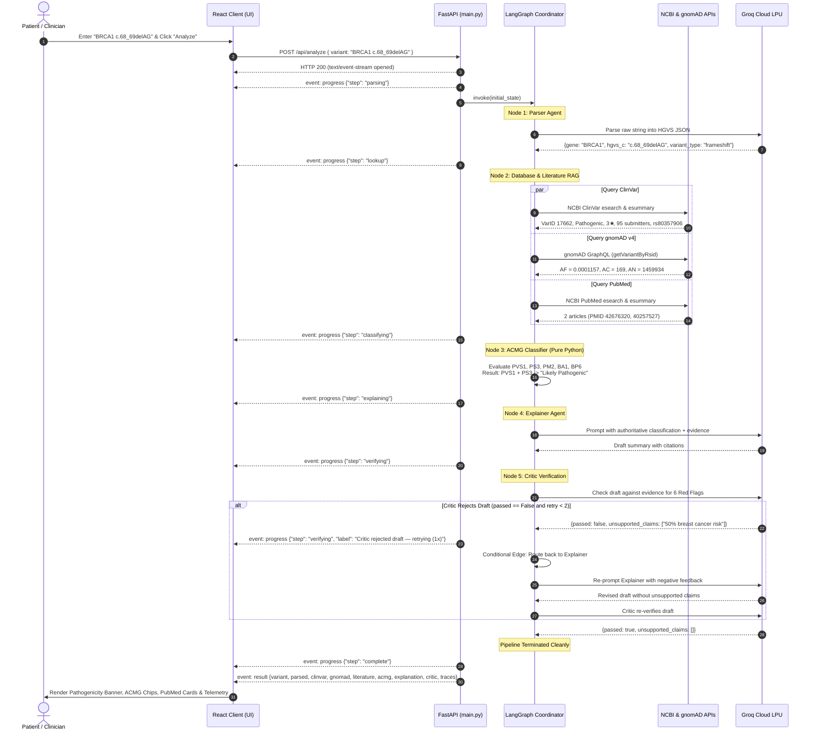

# GenomeGuide: System Architecture & Data Flow Guide 🧬

This document provides a comprehensive technical reference for the **GenomeGuide** platform. It details the underlying problems, clinical motivation, architectural design, state machine flow, node-by-node data transformations, API endpoint specifications, and live biomedical integrations.

---

## Table of Contents

1. [Executive Summary & Problem Statement](#1-executive-summary--problem-statement)
2. [The GenomeGuide Solution: Dual-RAG & Deterministic Safety](#2-the-genomeguide-solution-dual-rag--deterministic-safety)
3. [System Architecture Diagrams](#3-system-architecture-diagrams)
   - [3.1 Multi-Tier System Topology](#31-multi-tier-system-topology)
   - [3.2 State Machine Sequence & Feedback Loop](#32-state-machine-sequence--feedback-loop)
4. [Shared State Schema (`GenomeGuideState`)](#4-shared-state-schema-genomeguidestate)
5. [Node-by-Node Data Flow (`Input → Process → Output`)](#5-node-by-node-data-flow-input--process--output)
   - [5.1 Node 1: Variant Parser Agent](#51-node-1-variant-parser-agent)
   - [5.2 Node 2: Multi-Source RAG Lookup Engine](#52-node-2-multi-source-rag-lookup-engine)
   - [5.3 Node 3: Deterministic ACMG/AMP Rule Engine](#53-node-3-deterministic-acmgamp-rule-engine)
   - [5.4 Node 4: Patient-Centered Explainer Agent](#54-node-4-patient-centered-explainer-agent)
   - [5.5 Node 5: Adversarial Verification Critic Agent](#55-node-5-adversarial-verification-critic-agent)
6. [End-to-End Execution Walkthroughs](#6-end-to-end-execution-walkthroughs)
   - [6.1 Trace 1: Pathogenic Frameshift Deletion (`BRCA1 c.68_69delAG`)](#61-trace-1-pathogenic-frameshift-deletion-brca1-c68_69delag)
   - [6.2 Trace 2: Reflexive Rejection & Revision Loop](#62-trace-2-reflexive-rejection--revision-loop)
   - [6.3 Trace 3: Common Benign Polymorphism (`BA1` Trigger)](#63-trace-3-common-benign-polymorphism-ba1-trigger)
7. [API Endpoint Flow & Communication Protocol](#7-api-endpoint-flow--communication-protocol)
   - [7.1 Transport Architecture (SSE Stream)](#71-transport-architecture-sse-stream)
   - [7.2 Endpoint Catalog](#72-endpoint-catalog)
   - [7.3 Detailed Endpoint Specifications](#73-detailed-endpoint-specifications)
   - [7.4 Client Consumption Pipeline](#74-client-consumption-pipeline)
8. [Observability, Telemetry & Failure Recovery](#8-observability-telemetry--failure-recovery)

---

## 1. Executive Summary & Problem Statement

### 1.1 The Genetic Counseling Bottleneck
Next-Generation Sequencing (NGS) has made whole-exome and targeted panel sequencing accessible at low cost. However, the downstream clinical interpretation process suffers from severe systemic friction:
* **Severe Personnel Shortages**: In the US and worldwide, the ratio of certified genetic counselors to the general population is approximately **1 per 75,000**. Appointment wait times for post-test genetic counseling commonly range from **12 to 24 weeks**.
* **Opaque Molecular Nomenclature**: Patients receive lab PDF reports stating HGVS coordinates (such as `BRCA1 c.68_69delAG (p.Glu23fs)` or `CFTR c.1521_1523delCTT`). Without rapid, compassionate clinical translation, patients turn to uncurated search engines, causing high levels of distress.

### 1.2 The Catastrophic Failure Mode of Generic LLMs in Genomics
When general-purpose conversational LLMs (such as ChatGPT or Claude) are asked to interpret raw genomic variants:
1. **Stochastic Clinical Decisions**: LLMs are statistical autoregressive text generators. They frequently hallucinate pathogenic classifications for completely benign population polymorphisms.
2. **Nomenclature Confusion**: Generic LLMs mix up coding DNA positions (`c.`), genomic coordinates (`g.`), and protein residues (`p.`), frequently mistaking synonymous substitutions for catastrophic frameshift mutations.
3. **Fabricated Biomedical Literature**: LLMs regularly fabricate plausible-sounding PubMed IDs (PMIDs), author lists, and journal citations that do not exist.
4. **Directional Medical Disasters**: Advising a patient with a benign variant that they carry an actionable oncogenic mutation can trigger unnecessary prophylactic organ removal (e.g., bilateral mastectomy). Conversely, misclassifying a high-penetrance mutation as benign leads to missed oncologic screening.

---

## 2. The GenomeGuide Solution: Dual-RAG & Deterministic Safety

GenomeGuide solves these challenges by implementing an **agentic state machine** governed by three core principles:

1. **Deterministic Clinical Verdicts**:
   The clinical classification (**Pathogenic**, **Likely Pathogenic**, **VUS**, **Likely Benign**, **Benign**) is calculated using a **pure Python rule engine** adhering to the 2015 ACMG/AMP guidelines. **No LLM is permitted to determine or alter the clinical verdict.**
2. **Dual-RAG Grounding**:
   - **Structured Database RAG**: Live queries to **NCBI ClinVar** (review stars, expert panel assertions, submitter agreement) and **Broad Institute gnomAD v4** (global population allele frequencies across $\approx 1.45\text{M}$ alleles).
   - **Unstructured Literature RAG**: Real-time queries to **NCBI PubMed Entrez E-Utilities** retrieving peer-reviewed literature with verified PMIDs.
3. **Adversarial Verification Loop**:
   An independent **Critic Agent** audits the patient-facing explanation generated by the Explainer LLM. If the draft contains hallucinated numbers, incorrect classifications, or fabricated citations, the Critic rejects the draft and forces an automated revision loop with targeted negative feedback.

---

## 3. System Architecture Diagrams

### 3.1 Multi-Tier System Topology

```mermaid
graph TD
    subgraph Client ["Client Presentation Layer (React 19 + Vite)"]
        UI["AppDashboard / ResultsReport<br/>(Tailored Clinical UI)"]
        Dna3D["DnaDoubleHelix<br/>(Three.js 3D Molecular Simulation)"]
        SSEListener["EventSource / Fetch Stream<br/>(genomeguide.js)"]
        StateHook["useVariantAnalysis Hook<br/>(Reactive Progression)"]
        TelemetryTab["Pipeline Traces Inspector<br/>(Latency & JSON I/O)"]
        
        UI <--> StateHook
        StateHook <--> SSEListener
        UI --> TelemetryTab
    end

    subgraph Gateway ["Network & Transport Gateway"]
        ViteProxy["Vite Dev Reverse Proxy<br/>(:5173/api -> :8000/api)"]
        FastAPI["FastAPI App (main.py)<br/>(Async Lifespan & CORS)"]
        SSEStream["StreamingResponse<br/>(text/event-stream)"]
        
        SSEListener <-->|HTTP /api/analyze| ViteProxy
        ViteProxy <--> FastAPI
        FastAPI --> SSEStream
    end

    subgraph StateMachine ["LangGraph State Machine Engine (graph.py)"]
        StateChannel["GenomeGuideState<br/>(TypedDict Shared Memory)"]
        
        Parser["1. Parser Agent<br/>(Groq LLaMA 3.1 + Regex Fallback)"]
        Lookup["2. Database & Literature RAG<br/>(asyncio.gather)"]
        Classifier["3. ACMG Rule Engine<br/>(Deterministic Python Logic)"]
        Explainer["4. Explainer Agent<br/>(Groq LLaMA 3.1 Patient Synthesis)"]
        Critic["5. Adversarial Critic Agent<br/>(Groq LLaMA 3.1 Fact-Checker)"]
        
        FastAPI -->|Init State| StateChannel
        StateChannel --> Parser
        Parser -->|parsed| StateChannel
        StateChannel --> Lookup
        Lookup -->|clinvar_result, gnomad_result, literature| StateChannel
        StateChannel --> Classifier
        Classifier -->|acmg_evidence| StateChannel
        StateChannel --> Explainer
        Explainer -->|draft_explanation| StateChannel
        StateChannel --> Critic
        Critic -->|critic_verdict| StateChannel
        
        Critic -- "passed == False & retry < 2" -->|Conditional Edge (Retry)| Explainer
        Critic -- "passed == True" -->|Final Result Payload| SSEStream
    end

    subgraph External ["External Biomedical APIs & Cloud Services"]
        NCBI_ClinVar["NCBI ClinVar E-Utilities<br/>(esearch & esummary)"]
        Broad_gnomAD["Broad Institute gnomAD v4<br/>(GraphQL API)"]
        NCBI_PubMed["NCBI PubMed Entrez E-Utilities<br/>(esearch & esummary)"]
        GroqCloud["Groq Cloud LPU<br/>(LLaMA 3.1 70B Fast Inference)"]
        LangSmith["LangSmith v2<br/>(Cloud Telemetry & Observability)"]
        
        Parser -.->|LLM Token Parsing| GroqCloud
        Lookup -.->|REST HTTP| NCBI_ClinVar
        Lookup -.->|GraphQL HTTP| Broad_gnomAD
        Lookup -.->|REST HTTP| NCBI_PubMed
        Explainer -.->|Constrained LLM| GroqCloud
        Critic -.->|Adversarial Check| GroqCloud
        StateMachine -.->|Traces Telemetry| LangSmith
    end

    classDef client fill:#f8fafc,stroke:#64748b,stroke-width:1px;
    classDef gateway fill:#f1f5f9,stroke:#475569,stroke-width:1px;
    classDef state fill:#ecfdf5,stroke:#059669,stroke-width:2px;
    classDef node fill:#e0f2fe,stroke:#0284c7,stroke-width:1px;
    classDef rule fill:#fef3c7,stroke:#d97706,stroke-width:2px;
    classDef ext fill:#faf5ff,stroke:#7c3aed,stroke-width:1px;

    class UI,Dna3D,SSEListener,StateHook,TelemetryTab client;
    class ViteProxy,FastAPI,SSEStream gateway;
    class StateChannel state;
    class Parser,Lookup,Explainer,Critic node;
    class Classifier rule;
    class NCBI_ClinVar,Broad_gnomAD,NCBI_PubMed,GroqCloud,LangSmith ext;
```

---

### 3.2 State Machine Sequence & Feedback Loop

The following sequence diagram outlines the chronological execution, thread handoff, and conditional retry loop:



---

## 4. Shared State Schema (`GenomeGuideState`)

In LangGraph, all agent nodes share a single typed data structure defined in `backend/state.py`. As the state flows from node to node, each agent inspects the fields it requires and attaches its generated findings.

```python
class GenomeGuideState(TypedDict):
    # --- Input Payload ---
    raw_variant_input: str

    # --- Node 1: Parser Agent ---
    parsed: Optional[ParsedVariant]
    parse_error: Optional[str]

    # --- Node 2: Database & Literature RAG ---
    clinvar_result: Optional[ClinVarResult]
    gnomad_result: Optional[GnomADResult]
    literature_evidence: Optional[List[Dict]]

    # --- Node 3: ACMG Deterministic Rule Engine ---
    acmg_evidence: Optional[ACMGEvidence]

    # --- Node 4: Patient Explainer Agent ---
    draft_explanation: Optional[str]
    explainer_retry_count: int

    # --- Node 5: Adversarial Critic Guardrail ---
    critic_verdict: Optional[CriticVerdict]

    # --- Telemetry & Trace Observability ---
    traces: Optional[List[Dict]]

    # --- Final Output ---
    final_output: Optional[str]
    pipeline_error: Optional[str]
```

### Sub-Type Definitions

#### `ParsedVariant`
```python
class ParsedVariant(TypedDict):
    gene: str              # HGNC official symbol (e.g. "BRCA1")
    hgvs_c: str            # cDNA notation (e.g. "c.68_69delAG")
    hgvs_p: Optional[str]  # Protein notation (e.g. "p.Glu23fs")
    variant_type: str      # frameshift | nonsense | deletion | duplication | substitution | indel | splice
```

#### `ClinVarResult`
```python
class ClinVarResult(TypedDict):
    found: bool
    variation_id: Optional[str]    # NCBI ClinVar Variation ID (e.g. "17662")
    classification: Optional[str]  # Pathogenic | Likely pathogenic | VUS | Likely benign | Benign
    review_status: Optional[str]   # e.g. "reviewed by expert panel"
    star_rating: int               # 0 to 4 stars
    submitters: int                # Count of independent submitter SCVs
    conflicting: bool              # True if conflicting submissions exist
```

#### `GnomADResult`
```python
class GnomADResult(TypedDict):
    found: bool
    allele_frequency: Optional[float]  # Global population AF (e.g. 0.0001157)
    allele_count: Optional[int]        # AC (observed mutant alleles)
    allele_number: Optional[int]       # AN (total alleles sequenced)
    dataset: str                       # "gnomad_r4" or "gnomad_clinvar_record"
```

#### `ACMGEvidence`
```python
class ACMGEvidence(TypedDict):
    triggered_criteria: List[str]      # e.g. ["PVS1", "PS3"]
    criteria_details: Dict[str, str]   # Criterion -> rationale explanation
    classification: str                # Pathogenic | Likely Pathogenic | VUS | Likely Benign | Benign
    confidence: str                    # High | Moderate | Low
```

#### `CriticVerdict`
```python
class CriticVerdict(TypedDict):
    passed: bool
    unsupported_claims: List[str]      # Problematic quotes rejected by critic
    retry_count: int                   # Current retry attempt index (max 2)
```

---

## 5. Node-by-Node Data Flow (`Input → Process → Output`)

### 5.1 Node 1: Variant Parser Agent
* **Source File**: `backend/agents/parser_agent.py`
* **Execution Mechanism**: Groq Cloud LLM (`ChatGroq`) with fallback to local regex parser.

| Dimension | Specification |
| :--- | :--- |
| **Reads from State** | `state["raw_variant_input"]` |
| **Processing Logic** | 1. Sends raw string to Groq LLaMA with a strict system prompt specifying HGNC symbol extraction, cDNA identification (`c.`), and molecular consequence categorization.<br/>2. If LLM fails or API times out, executes regex pattern matching `([A-Z0-9]+)\s*[:\s]\s*(c\.[^\s,]+)` and computes reading-frame shift length (`length % 3 != 0`). |
| **Writes to State** | `parsed: ParsedVariant`, `parse_error: Optional[str]` |
| **Downstream Consumers** | Node 2 (Lookup), Node 3 (Classifier), Node 4 (Explainer) |

---

### 5.2 Node 2: Multi-Source RAG Lookup Engine
* **Source Files**: `backend/agents/lookup_agent.py`, `backend/agents/literature_agent.py`
* **Execution Mechanism**: Async HTTP requests executed concurrently using `asyncio.gather`.

```
                    ┌─► 2A: ClinVar E-Utilities (REST) ─────────┐
parsed (gene, hgvs) ┼─► 2B: gnomAD v4 GraphQL (API) ────────────┼─► state update
                    └─► 2C: PubMed Entrez Literature RAG (REST) ┘
```

| Dimension | Specification |
| :--- | :--- |
| **Reads from State** | `state["parsed"]` |
| **Sub-agent 2A (ClinVar)** | Queries `esearch.fcgi` for `term="{gene}[gene] AND {hgvs_c}[variant name]"`. Uses the returned ID to query `esummary.fcgi`. Maps `review_status` to star ratings (0–4), tallies submitters, detects conflicts, and extracts dbSNP `rsID`. |
| **Sub-agent 2B (gnomAD)** | Queries the Broad Institute GraphQL endpoint with `rsid` to pull exome and genome allele count (`ac`), allele number (`an`), and calculate allele frequency ($AF = ac / an$). If absent, sets $AF = 0.0$ (`PM2` rare/absent). |
| **Sub-agent 2C (PubMed)** | Queries Entrez E-Utilities for `{gene}[Title/Abstract] AND ("{hgvs_c}" OR "{short_hgvs}")`. Fetches publication metadata for up to 3 studies, extracting PMID, title, journal, lead author, and year. |
| **Writes to State** | `clinvar_result: ClinVarResult`, `gnomad_result: GnomADResult`, `literature_evidence: List[Dict]` |
| **Downstream Consumers** | Node 3 (Classifier), Node 4 (Explainer), Node 5 (Critic) |

---

### 5.3 Node 3: Deterministic ACMG/AMP Rule Engine
* **Source File**: `backend/agents/classifier_agent.py`
* **Execution Mechanism**: **Pure Python algorithmic logic (No LLM).**

| Dimension | Specification |
| :--- | :--- |
| **Reads from State** | `state["parsed"]`, `state["clinvar_result"]`, `state["gnomad_result"]` |
| **Implemented Criteria** | 1. **`BA1` (Stand-alone Benign)**: Triggered if gnomAD $AF > 0.05$ (5.0%). Overrides all other criteria.<br/>2. **`PVS1` (Very Strong Pathogenic)**: Triggered if `variant_type` is in `["frameshift", "nonsense", "splice"]` and `gene` belongs to verified loss-of-function genes (`LOF_GENES`).<br/>3. **`PS3` / `PP5` (Strong / Supporting Pathogenic)**: Triggered if ClinVar classification is Pathogenic, $\ge 2$ submitters agree, review status is $\ge 2$ stars, and no conflicts exist.<br/>4. **`PM2` (Moderate Pathogenic)**: Triggered if variant is absent from gnomAD or $AF < 0.0001$ ($0.01\%$).<br/>5. **`BP6` (Supporting Benign)**: Triggered if ClinVar consensus is Benign/Likely Benign with $\ge 1$ star and zero conflicts. |
| **Combination Rules** | - $\text{BA1} \longrightarrow \textbf{Benign}$ (Confidence: High)<br/>- $\text{PVS1} + \text{PM2} \longrightarrow \textbf{Pathogenic}$ (Confidence: High)<br/>- $\text{PVS1 alone} \longrightarrow \textbf{Likely Pathogenic}$ (Confidence: Moderate)<br/>- $\text{PS3 with } \ge 2\text{ stars} \longrightarrow \textbf{Pathogenic}$ (Confidence: High)<br/>- $\text{PP5} \longrightarrow \textbf{Likely Pathogenic}$ (Confidence: Moderate)<br/>- $\text{BP6} \longrightarrow \textbf{Likely Benign / Benign}$ (Confidence: Moderate)<br/>- $\text{PM2 alone or ambiguous} \longrightarrow \textbf{Variant of Uncertain Significance (VUS)}$ (Conservative default) |
| **Writes to State** | `acmg_evidence: ACMGEvidence` |
| **Downstream Consumers** | Node 4 (Explainer), Node 5 (Critic) |

---

### 5.4 Node 4: Patient-Centered Explainer Agent
* **Source File**: `backend/agents/explainer_agent.py`
* **Execution Mechanism**: Groq Cloud LLM (`ChatGroq`) constrained by strict prompt instructions.

| Dimension | Specification |
| :--- | :--- |
| **Reads from State** | `state["parsed"]`, `state["acmg_evidence"]`, `state["clinvar_result"]`, `state["gnomad_result"]`, `state["literature_evidence"]`, `state["critic_verdict"]` (if on retry) |
| **Processing Logic** | 1. Injects the authoritative classification into the prompt with an explicit command: *Do NOT change or soften the classification.*<br/>2. Formulates patient-friendly language explaining the molecular consequence, population frequency, and clinical submissions.<br/>3. Directs the LLM to cite genuine literature using in-text brackets (e.g. `[PMID: 42676320]`).<br/>4. If on retry, explicitly injects the rejected claims from the Critic verdict under a `CRITIC FEEDBACK` header with instructions to remove them.<br/>5. Appends a standardized medical disclaimer (`DISCLAIMER`). |
| **Writes to State** | `draft_explanation: str`, `explainer_retry_count: int` |
| **Downstream Consumers** | Node 5 (Critic) |

---

### 5.5 Node 5: Adversarial Verification Critic Agent
* **Source File**: `backend/agents/critic_agent.py`
* **Execution Mechanism**: Groq Cloud LLM (`temperature=0`) acting as an adversarial fact-checker, governing the conditional routing edge.

| Dimension | Specification |
| :--- | :--- |
| **Reads from State** | `state["draft_explanation"]`, `state["acmg_evidence"]`, `state["clinvar_result"]`, `state["gnomad_result"]` |
| **Verification Checks (6 Red Flags)** | 1. **Risk Percentages**: Rejects any numerical risk or penetrance figure not in the evidence (e.g. *"85% risk of breast cancer"*).<br/>2. **Classification Discrepancy**: Rejects any statement that disagrees with `acmg_evidence["classification"]`.<br/>3. **Family Risk Speculation**: Rejects unwarranted statements about family members.<br/>4. **Unmentioned Syndromes**: Rejects disease claims not grounded in the gene's known biology.<br/>5. **Fabricated Statistics**: Rejects unbacked empirical claims.<br/>6. **Data Contradictions**: Rejects distorted allele counts or star ratings. |
| **Conditional Edge Logic (`should_retry`)** | - If `critic_verdict["passed"] == True` $\longrightarrow$ returns `"end"`, sets `final_output = draft_explanation`.<br/>- If `critic_verdict["passed"] == False` and `retry_count < 2` $\longrightarrow$ returns `"retry"`, routes back to `explainer_node`.<br/>- If `retry_count >= 2` $\longrightarrow$ returns `"end"`, prevents infinite looping. |
| **Writes to State** | `critic_verdict: CriticVerdict`, `final_output: Optional[str]` |
| **Downstream Consumers** | Client SSE Stream (Final Result Payload) |

---

## 6. End-to-End Execution Walkthroughs

### 6.1 Trace 1: Pathogenic Frameshift Deletion (`BRCA1 c.68_69delAG`)

#### Step 0: Input Submission
```json
{
  "raw_variant_input": "BRCA1 c.68_69delAG"
}
```

#### Step 1: Parser Agent Output
```json
"parsed": {
  "gene": "BRCA1",
  "hgvs_c": "c.68_69delAG",
  "hgvs_p": "p.Glu23fs",
  "variant_type": "frameshift"
}
```

#### Step 2: Multi-Source RAG Output
```json
"clinvar_result": {
  "found": true,
  "variation_id": "17662",
  "classification": "Pathogenic",
  "review_status": "reviewed by expert panel",
  "star_rating": 3,
  "submitters": 95,
  "conflicting": false
},
"gnomad_result": {
  "found": true,
  "allele_frequency": 0.000115758,
  "allele_count": 169,
  "allele_number": 1459934,
  "dataset": "gnomad_r4"
},
"literature_evidence": [
  {
    "pmid": "42676320",
    "title": "BRCA1 Gene's Mutations And Hereditary Breast Cancer...",
    "journal": "Curr Issues Mol Biol",
    "year": "2024",
    "url": "https://pubmed.ncbi.nlm.nih.gov/42676320/"
  }
]
```

#### Step 3: ACMG Classifier Output
```json
"acmg_evidence": {
  "triggered_criteria": ["PVS1", "PS3"],
  "criteria_details": {
    "PVS1": "Frameshift variant in BRCA1, a gene where loss-of-function is a well-established disease mechanism (OMIM confirmed).",
    "PS3": "ClinVar classification: 'Pathogenic' with 95 independent submitters and review status 'reviewed by expert panel' (3★). Multiple laboratories agree."
  },
  "classification": "Likely Pathogenic",
  "confidence": "High"
}
```

#### Step 4: Explainer Agent Output
```markdown
### Genetic Variant Summary: BRCA1 c.68_69delAG

**1. What This Variant Is**
Your test identified a frameshift mutation in the *BRCA1* gene. In this variant, two DNA building blocks (AG) are missing, which disrupts how the cell reads the genetic instructions and results in a truncated, non-functional protein.

**2. What the Classification Means**
This variant is classified as **Likely Pathogenic** according to standardized ACMG/AMP criteria. This indicates that scientific and clinical consensus strongly links this mutation with impaired gene function.

**3. Evidence Summary**
- **Loss of Function**: Disrupts a critical tumor suppressor pathway (PVS1 criterion).
- **Clinical Consensus**: Submitted by 95 independent clinical laboratories to ClinVar with unanimous pathogenic consensus and reviewed by an expert panel (3★).
- **Population Frequency**: Extremely rare, observed in approximately 0.011% of individuals in the gnomAD population database.
- **Published Research**: Documented in hereditary cancer literature [PMID: 42676320].

**4. Next Steps**
Please discuss this finding with a certified genetic counselor to review surveillance recommendations and family history.

---
⚠️ **Important Medical Disclaimer**: This report is an educational tool...
```

#### Step 5: Critic Verification
```json
"critic_verdict": {
  "passed": true,
  "unsupported_claims": [],
  "retry_count": 1
}
```
*Passed on first check $\rightarrow$ State transitions directly to final output.*

---

### 6.2 Trace 2: Reflexive Rejection & Revision Loop

To illustrate the adversarial guardrail, consider an execution where the Explainer LLM attempts to generate speculative clinical statistics:

```
[Explainer Draft 1]
"...Individuals with this BRCA1 variant have an 85% lifetime risk of developing breast cancer 
and a 50% risk of ovarian cancer..."

        │
        ▼
[Critic Agent Evaluation]
Scans draft against retrieved state evidence.
Detected Red Flag #1: "85% lifetime risk" and "50% risk" do not appear anywhere in the 
retrieved ClinVar, gnomAD, or ACMG evidence fields.

        │
        ▼
[Critic Verdict]
{
  "passed": false,
  "unsupported_claims": [
    "Individuals with this BRCA1 variant have an 85% lifetime risk of developing breast cancer and a 50% risk of ovarian cancer"
  ],
  "retry_count": 1
}

        │
        ▼
[LangGraph Conditional Edge]
should_retry() evaluates: passed is False and retry_count < 2 -> Returns "retry"
Re-invokes explainer_node with updated state containing rejected claim.

        │
        ▼
[Explainer Prompt on Attempt 2]
Includes:
=== CRITIC FEEDBACK (previous draft rejected) ===
REJECTED CLAIM: Individuals with this BRCA1 variant have an 85% lifetime risk...
-> Remove ALL rejected claims from your new draft.

        │
        ▼
[Explainer Draft 2]
"...This variant impairs normal BRCA1 tumor suppressor activity. Specific cancer risk 
estimates depend on your comprehensive personal and family history and must be 
evaluated with a medical geneticist..."

        │
        ▼
[Critic Agent Re-evaluation]
{
  "passed": true,
  "unsupported_claims": [],
  "retry_count": 2
}
✓ Verification passed -> Emits final report.
```

---

### 6.3 Trace 3: Common Benign Polymorphism (`BA1` Trigger)

When an allele frequency exceeds 5.0%, GenomeGuide triggers the stand-alone benign override:

```json
// Upstream gnomAD lookup
"gnomad_result": {
  "found": true,
  "allele_frequency": 0.3845,
  "allele_count": 561340,
  "allele_number": 1459934
}

// Classifier Rule Evaluation
// af (0.3845) > AF_COMMON (0.05) -> Triggers BA1
"acmg_evidence": {
  "triggered_criteria": ["BA1"],
  "criteria_details": {
    "BA1": "Allele frequency 0.3845 (38.45%) in gnomAD — exceeds 5% threshold. Variant is too common in the general population to be a rare disease-causing allele."
  },
  "classification": "Benign",
  "confidence": "High"
}
```

---

## 7. API Endpoint Flow & Communication Protocol

### 7.1 Transport Architecture (SSE Stream)
GenomeGuide uses **Server-Sent Events (SSE)** over standard HTTP. SSE offers distinct advantages over WebSockets for this application:
* **Uni-directional Streaming**: Progress updates flow strictly from backend to frontend.
* **Lightweight Protocol**: Operates over standard HTTP/1.1 and HTTP/2 without socket connection upgrades.
* **Proxy Resilient**: Works out-of-the-box through standard corporate firewalls, reverse proxies, and edge networks with headers:
  ```http
  Content-Type: text/event-stream; charset=utf-8
  Cache-Control: no-cache
  Connection: keep-alive
  X-Accel-Buffering: no
  ```

---

### 7.2 Endpoint Catalog

| HTTP Method | Route | Purpose | Input Format | Output Format |
| :--- | :--- | :--- | :--- | :--- |
| `POST` | `/api/analyze` | Initiates pipeline analysis & streams SSE progress | JSON Body | `text/event-stream` |
| `GET` | `/api/analyze/stream` | Streams SSE progress via URL query parameter | Query String | `text/event-stream` |
| `GET` | `/api/health` | Service health, version & API credentials check | None | `application/json` |
| `GET` | `/api/examples` | Curated clinical reference variants catalog | None | `application/json` |
| `GET` | `/api/eval-results` | Accuracy benchmarks on 50 held-out ClinVar test cases | None | `application/json` |

---

### 7.3 Detailed Endpoint Specifications

#### 1. `POST /api/analyze`
Executes the full 5-agent LangGraph state machine.

* **Request Headers**:
  ```http
  Content-Type: application/json
  Accept: text/event-stream
  ```
* **Request Body Schema**:
  ```json
  {
    "variant": "string (Required, 1-500 characters)"
  }
  ```
* **Event Sequence**:
  1. `event: progress` (`step: "parsing"`)
  2. `event: progress` (`step: "lookup"`)
  3. `event: progress` (`step: "classifying"`)
  4. `event: progress` (`step: "explaining"`)
  5. `event: progress` (`step: "verifying"`)
  6. `event: progress` (`step: "complete"`)
  7. `event: result` (full payload)

* **Sample Progress Event**:
  ```http
  event: progress
  data: {"step": "lookup", "label": "ClinVar, gnomAD & PubMed queried", "agent": "Database & Literature Agent"}
  ```

* **Sample Result Event**:
  ```http
  event: result
  data: {
    "variant": "BRCA1 c.68_69delAG",
    "parsed": { "gene": "BRCA1", "hgvs_c": "c.68_69delAG", "variant_type": "frameshift" },
    "clinvar": { "found": true, "variation_id": "17662", "classification": "Pathogenic", "star_rating": 3, "submitters": 95, "conflicting": false },
    "gnomad": { "found": true, "allele_frequency": 0.0001157, "allele_count": 169, "allele_number": 1459934 },
    "literature": [{ "pmid": "42676320", "title": "BRCA1 Gene's Mutations...", "url": "https://pubmed.ncbi.nlm.nih.gov/42676320/" }],
    "acmg": { "triggered_criteria": ["PVS1", "PS3"], "classification": "Likely Pathogenic", "confidence": "High" },
    "explanation": "### Genetic Variant Summary: BRCA1 c.68_69delAG...",
    "critic": { "passed": true, "unsupported_claims": [], "retry_count": 0 },
    "traces": [...],
    "total_latency_ms": 3062
  }
  ```

---

#### 2. `GET /api/analyze/stream?variant={notation}`
Allows streaming analysis using simple HTTP GET requests. Ideal for CLI testing with `curl` or direct browser inspection:
```bash
curl -N "http://localhost:8000/api/analyze/stream?variant=BRCA1%20c.68_69delAG"
```

---

#### 3. `GET /api/health`
Returns service health and configuration status:
```json
{
  "status": "ok",
  "version": "1.0.0",
  "groq_configured": true,
  "ncbi_key_configured": false
}
```

---

#### 4. `GET /api/examples`
Returns pre-curated test cases representing diverse clinical categories:
```json
[
  {
    "label": "BRCA1 c.68_69delAG",
    "variant": "BRCA1 c.68_69delAG",
    "expected": "Pathogenic",
    "gene": "BRCA1",
    "description": "Frameshift deletion — hereditary breast/ovarian cancer (LOF)"
  },
  {
    "label": "CFTR c.1521_1523delCTT",
    "variant": "CFTR c.1521_1523delCTT",
    "expected": "Pathogenic",
    "gene": "CFTR",
    "description": "delF508 — most common cystic fibrosis causative variant"
  },
  {
    "label": "BRCA1 c.1314G>A",
    "variant": "BRCA1 c.1314G>A",
    "expected": "Likely Benign",
    "gene": "BRCA1",
    "description": "Synonymous polymorphism — benign population variant"
  },
  {
    "label": "BRCA1 c.3306T>A",
    "variant": "BRCA1 c.3306T>A",
    "expected": "VUS",
    "gene": "BRCA1",
    "description": "Variant of Uncertain Significance — insufficient clinical evidence"
  }
]
```

---

#### 5. `GET /api/eval-results`
Serves pre-computed accuracy metrics on 50 held-out ClinVar variants:
```json
{
  "dataset": "ClinVar held-out 2+ star review status",
  "total_variants": 50,
  "accuracy": 0.68,
  "directional_accuracy": 1.0,
  "directional_errors": 0,
  "confusion_matrix": {
    "Pathogenic":        { "Pathogenic": 7, "Likely Pathogenic": 0, "VUS": 7, "Likely Benign": 0, "Benign": 0 },
    "Likely Pathogenic": { "Pathogenic": 1, "Likely Pathogenic": 0, "VUS": 5, "Likely Benign": 0, "Benign": 0 },
    "VUS":               { "Pathogenic": 2, "Likely Pathogenic": 0, "VUS": 8, "Likely Benign": 0, "Benign": 0 },
    "Likely Benign":     { "Pathogenic": 0, "Likely Pathogenic": 0, "VUS": 1, "Likely Benign": 19, "Benign": 0 },
    "Benign":            { "Pathogenic": 0, "Likely Pathogenic": 0, "VUS": 0, "Likely Benign": 0, "Benign": 0 }
  }
}
```

---

### 7.4 Client Consumption Pipeline

The React frontend processes data through three distinct layers:

```
[FastAPI Backend] ──SSE HTTP Stream──► [frontend/src/api/genomeguide.js]
                                              │
                                        Reader Buffer &
                                        Event Parsing
                                              │
                                              ▼
                                 [useVariantAnalysis Hook]
                                  - status: 'loading' | 'success'
                                  - activeStep: 'parsing' | 'lookup'...
                                  - result: full JSON object
                                              │
                                              ▼
                                    [React Presentation UI]
                                  - Modal / Progress Bar
                                  - ResultsReport.jsx
                                  - Pipeline Traces Tab
```

1. **`genomeguide.js`**: Uses `fetch()` with `response.body.getReader()` and `TextDecoder`. Accumulates incoming byte chunks into a string buffer, splits on newlines (`\n\n`), parses `event: ` and `data: `, and invokes callbacks: `onProgress(data)`, `onResult(data)`, or `onError(msg)`.
2. **`useVariantAnalysis.js`**: React state management hook. Tracks `activeStep`, appends completed steps to `progress`, handles errors, and returns an `abort()` handle to cancel in-flight requests.
3. **`ResultsReport.jsx`**: Dynamically mounts when `result` is populated, rendering the Pathogenicity Banner, ACMG Criteria Pills, ClinVar Evidence, gnomAD Frequency Meter, authentic PubMed Cards, and Critic Verification Pills.

---

## 8. Observability, Telemetry & Failure Recovery

### 8.1 In-App Execution Trace Telemetry
For every executed variant, the backend records execution metrics for each state node. These metrics are transmitted in the final payload under the `traces` key and rendered in the **Pipeline Traces** tab:

```json
{
  "agent": "Parser Agent",
  "step": "HGVS Extraction & Normalization",
  "type": "LLM (Groq LPU)",
  "status": "success",
  "duration_ms": 280,
  "inputs": { "raw_input": "BRCA1 c.68_69delAG" },
  "outputs": { "gene": "BRCA1", "hgvs_c": "c.68_69delAG", "variant_type": "frameshift" }
}
```

### 8.2 LangSmith Cloud Tracing
GenomeGuide supports deep tracing via LangSmith v2. When configured in `backend/.env`:
```ini
LANGCHAIN_TRACING_V2=true
LANGCHAIN_ENDPOINT=https://api.smith.langchain.com
LANGCHAIN_API_KEY=lsv2_pt_...
LANGCHAIN_PROJECT=GenomeGuide
```
Every invocation automatically publishes tokens, prompt inputs, agent latencies, and state transitions to the LangSmith cloud monitoring dashboard.

### 8.3 Failure Recovery & Graceful Degradation

| Failure Mode | Detection Point | Automated Recovery Action |
| :--- | :--- | :--- |
| **Groq Cloud Outage / Rate Limit** | Node 1 (Parser) | Falls back automatically to local regex HGVS parser (`regex_parse_hgvs`). |
| **NCBI E-Utilities Timeout** | Node 2A (ClinVar) | Logs warning, proceeds with ClinVar `found=False`; downstream classifier relies on gnomAD and LOF gene mechanisms. |
| **gnomAD GraphQL Outage** | Node 2B (gnomAD) | Falls back to ClinVar-recorded gnomAD allele frequency, or treats variant as novel/absent (`PM2`). |
| **Groq Cloud Outage** | Node 4 (Explainer) | Automatically generates structured template report (`_build_fallback_explanation`). |
| **Critic Agent Failure** | Node 5 (Critic) | Automatically passes the draft with a disclaimer to prevent infinite blocking. |
| **Client Disconnection** | HTTP Transport | Fast cleanup handle in `useVariantAnalysis` calls `reader.cancel()`, aborting stream processing cleanly. |
